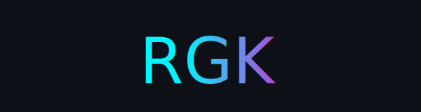

  

  

<!-- LIVE CONTRIBUTION SNAKE -->

  <picture>
    <source media="(prefers-color-scheme: dark)" srcset="https://raw.githubusercontent.com/Try-Ronnie/Try-Ronnie/output/github-contribution-grid-snake-dark.svg" />
    <source media="(prefers-color-scheme: light)" srcset="https://raw.githubusercontent.com/Try-Ronnie/Try-Ronnie/output/github-contribution-grid-snake.svg" />
    
  </picture>

<!-- CORE STATS DASHBOARD -->

  
  

<!-- ACHIEVEMENT GRID & LANGUAGES -->

  
  

<!-- NEON ANIMATED GRAPH -->

  

<!-- TECH STACK WITH PULSE EFFECT -->

  

<!-- INLINE NEON MOTION SVG (replaces assets/neon-motion.svg) -->

  <svg width="900" height="80" viewBox="0 0 900 80">
    <!-- ... (the glow + animated gradient from section 2) ... -->
    <text ...>⚡ BUILD. SHIP. REPEAT. ⚡</text>
  </svg>

<!-- GAME ENGINE DEMO REEL -->

  

<!-- FOOTER WAVE -->

  

