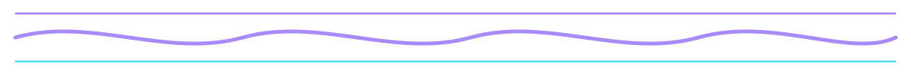
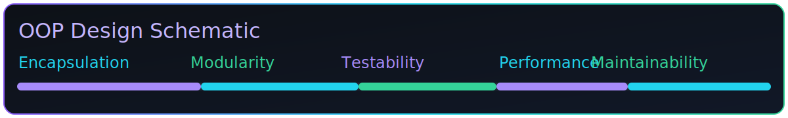
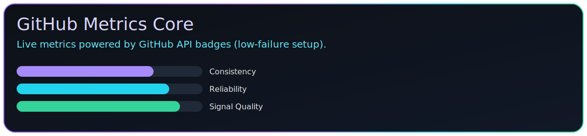
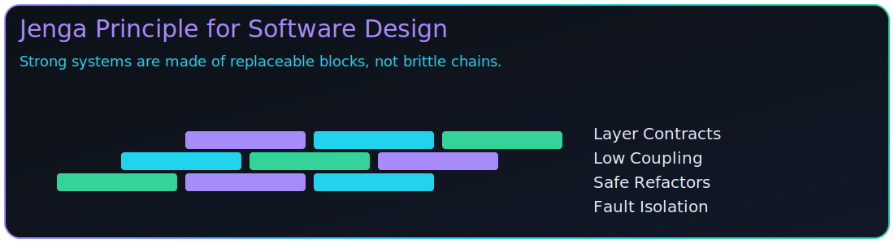
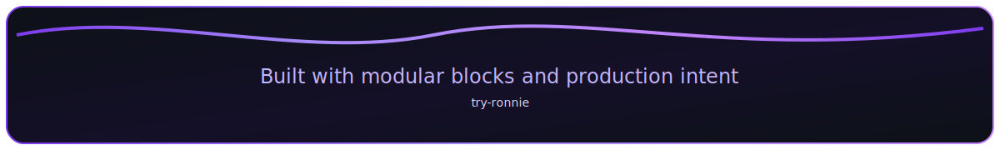

<p align="center">
  
</p>

<p align="center">
  
  
  
</p>

<p align="center">
  
</p>


## SYSTEM CORE

<p align="center">
  
</p>

<p align="center">
  
  
</p>

```python
class DeveloperProfile:
    def __init__(self):
        self.username = "try-ronnie"
        self.nickname = ["mzagatas", "mzagla"]
        self.stack = [
            "JavaScript", "Python", "Pygame", "Flask", "FastAPI",
            "React", "HTML", "CSS", "Git", "GitHub", "Linux"
        ]
        self.focus = "High Performance Systems"
        self.target = "Elite Problem Solving"
        self.daily_dev_account = "kiiruronnie42@gmail.com"
        self.phone = "0117967266"

    def mission(self):
        return "Design and deliver reliable, high-performance software systems."
```

```diff
+ PROFILE STATUS  : ACTIVE
+ ARCHITECTURE    : OOP + Modular
+ OPERATING MODE  : Production Ready
```

<p align="center">
  
  
  
</p>

<p align="center">
  
</p>


## PAC-MAN CONTRIBUTIONS

<p align="center">
  <picture>
    <source media="(prefers-color-scheme: dark)" srcset="ASSETS/pacman-dark.svg" />
    <source media="(prefers-color-scheme: light)" srcset="ASSETS/pacman-light.svg" />
    
  </picture>
</p>

<p align="center">
  
</p>


## DECORATIVE SNAKE

<p align="center">
  <picture>
    <source media="(prefers-color-scheme: dark)" srcset="ASSETS/snake-dark.svg" />
    <source media="(prefers-color-scheme: light)" srcset="ASSETS/snake-light.svg" />
    
  </picture>
</p>

<p align="center">
  
</p>


## GITHUB STATS

<p align="center">
  
</p>

<p align="center">
  
  
  
</p>

<p align="center">
  
  
  
</p>

<p align="center">
  <sub>Using a local core panel + GitHub API badges to avoid dead stats cards.</sub>
</p>

<p align="center">
  
</p>


## TECH ARSENAL

```python
class TechStack:
    def __init__(self):
        self.languages = ["JavaScript", "Python", "HTML", "CSS"]
        self.frameworks = ["React", "Flask", "FastAPI", "Pygame"]
        self.tools = ["Git", "GitHub", "Linux"]
```

<p align="center">
  
</p>

<p align="center">
  
  
  
  
</p>

<p align="center">
  
</p>


## GAME SYSTEMS LAB

<p align="center">
  
</p>

<p align="center">
  
  
</p>

```python
class GameSystems:
    def __init__(self):
        self.loops = "Structured game loops"
        self.physics = "Collision handling and response"
        self.ai = "Pathfinding and behavior scripting"
        self.ui = "Feedback and animation sequences"
        self.state = "Clean object-oriented architecture"

    def quality_gate(self):
        return ["readable", "modular", "testable", "performant"]
```

```diff
+ LOOP ENGINE     : Structured
+ PHYSICS LAYER   : Collision-Ready
+ AI LAYER        : Pathfinding + Behaviors
+ INTEGRITY MODEL : Jenga Principle
```

<p align="center">
  
  
  
</p>

<p align="center">
  
</p>


## ENGINEERING PHILOSOPHY

<p align="center">
  
</p>

```python
def engineering_philosophy():
    design("with intent")
    build("for resilience")
    optimize("where it matters")
    ship("clean, maintainable code")
    test("critical paths")
    maintain("performance budgets")
    embrace("modularity")
```

```diff
+ cyan   -> clarity
+ mint   -> stability
+ violet -> precision
```

<p align="center">
  
</p>


## JENGA PRINCIPLE

<p align="center">
  
</p>

```python
def jenga_principle(system):
    """
    Every block should be replaceable without collapsing the tower.
    If one module failure breaks everything, coupling is too high.
    """
    return "Design independent layers with explicit contracts."
```

<p align="center">
  
</p>


## COMPETITIVE CODING

<p align="center">
  
  
</p>

<p align="center">
  <a href="https://www.codewars.com/users/Ronnie.Codes.Too.Much">
    
  </a>
  <a href="https://leetcode.com/u/ronnie-is-a-gik/">
    
  </a>
</p>

<p align="center">
  
</p>


## CONTACT AND CONNECT

```python
contact = {
    "email": "kiiruronnie42@gmail.com",
    "whatsapp": "0797694892",
    "github": "https://github.com/try-ronnie",
    "daily_dev": "https://app.daily.dev/kiiru",
    "instagram": "https://instagram.com/st.o.rm_me/",
    "reddit": "https://www.reddit.com/user/Independent-Law-5397/",
    "stackoverflow": "https://stackoverflow.com/users/30851320/kiiru-ronnie"
}
```

<p align="center">
  <a href="mailto:kiiruronnie42@gmail.com">
    
  </a>
  <a href="https://github.com/try-ronnie">
    
  </a>
</p>

<p align="center">
  <a href="https://app.daily.dev/kiiru">
    
  </a>
  <a href="https://instagram.com/st.o.rm_me/">
    
  </a>
  <a href="https://www.reddit.com/user/Independent-Law-5397/">
    
  </a>
</p>

<p align="center">
  <a href="https://stackoverflow.com/users/30851320/kiiru-ronnie">
    
  </a>
  <a href="https://wa.me/254797694892">
    
  </a>
</p>

<p align="center">
  
</p>

<p align="center">
  
</p>
